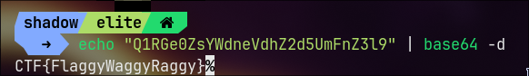
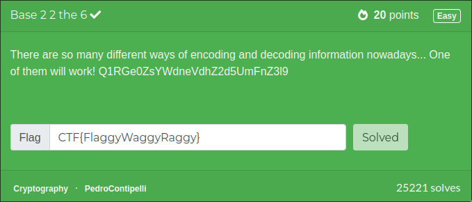

# challenge

There are so many different ways of encoding and decoding information nowadays... One of them will work! `Q1RGe0ZsYWdneVdhZ2d5UmFnZ3l9`

# solution

It is look like the encoding is `base64`
so i used shell to decode

so the flag is `CTF{FlaggyWaggyRaggy}`

