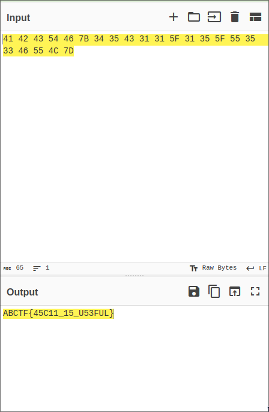
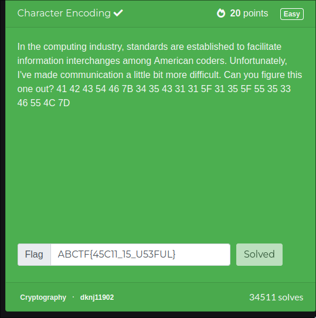

# challenge

https://ctflearn.com/challenge/115

`41 42 43 54 46 7B 34 35 43 31 31 5F 31 35 5F 55 35 33 46 55 4C 7D`

decode the given cipher

# solution
its very easy to identify that its hex encoded

so i use cyberchef to decode 

add recipe `from hex`

add we got the flag : `ABCTF{45C11_15_U53FUL}`

