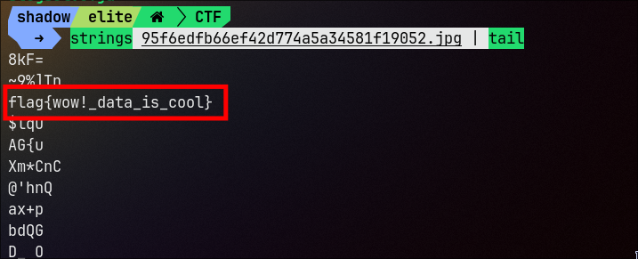
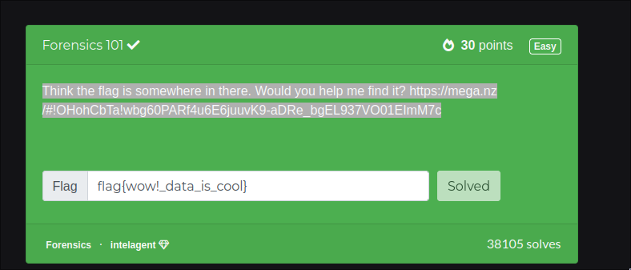

# challenge

Think the flag is somewhere in there. Would you help me find it? https://mega.nz/#!OHohCbTa!wbg60PARf4u6E6juuvK9-aDRe_bgEL937VO01EImM7c

i downloaded the file , it looks like a jpg file. 
i was able to find the flag very quickly , the first thing i look in an image file is exifdata of that file , and string

so i tried exiftool and strings

using strings i easily got the flag
`strings 95f6edfb66ef42d774a5a34581f19052.jpg | tail`

and that is the  flag

