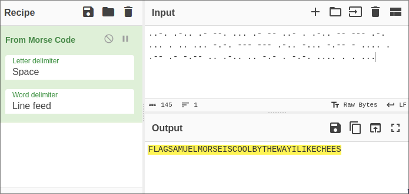
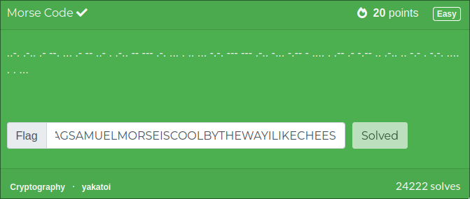

# challenge

`..-. .-.. .- --. ... .- -- ..- . .-.. -- --- .-. ... . .. ... -.-. --- --- .-.. -... -.-- - .... . .-- .- -.-- .. .-.. .. -.- . -.-. .... . . ...`

# solution 

the one is pretty straight forward the challenge name itself is morse code .

just use cyberchef morse code decoder

so the flag is `FLAGSAMUELMORSEISCOOLBYTHEWAYILIKECHEES`

