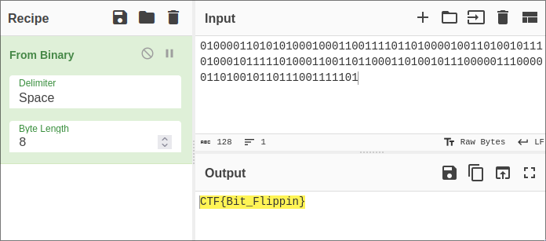
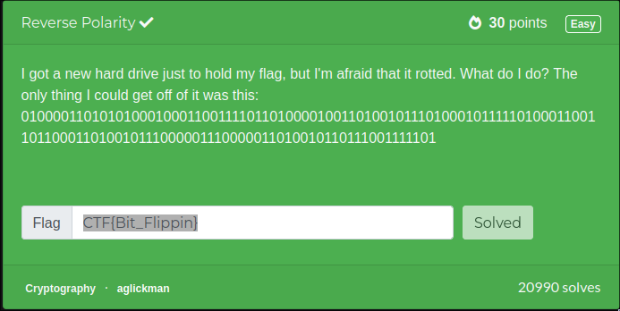

# challenge

I got a new hard drive just to hold my flag, but I'm afraid that it rotted. What do I do? The only thing I could get off of it was this: `01000011010101000100011001111011010000100110100101110100010111110100011001101100011010010111000001110000011010010110111001111101`

# solution

It's really easy the text its encoded in binary (0s and 1s)

using cyberchef we can easily decode

the flag is `CTF{Bit_Flippin}`

