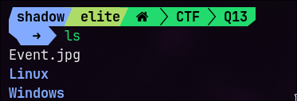
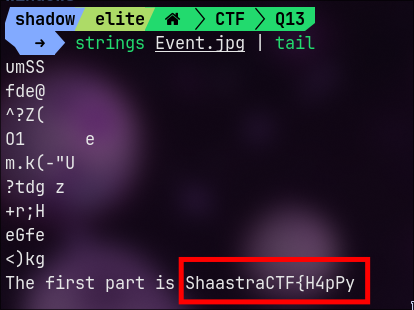
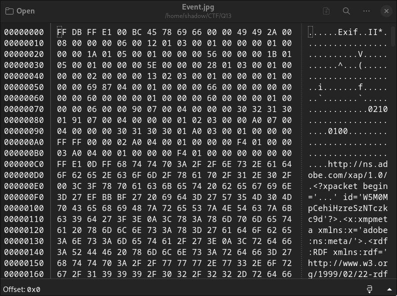
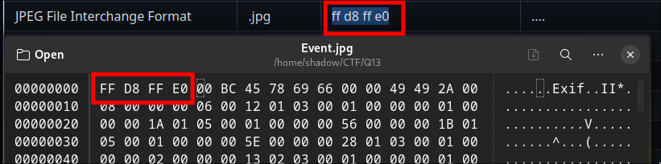
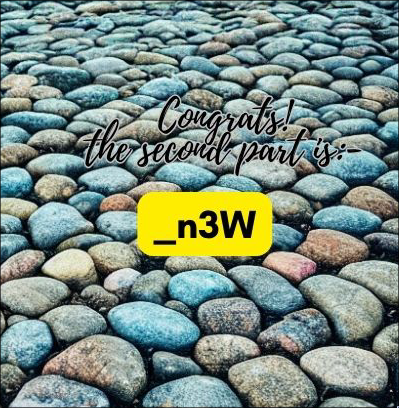
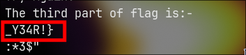
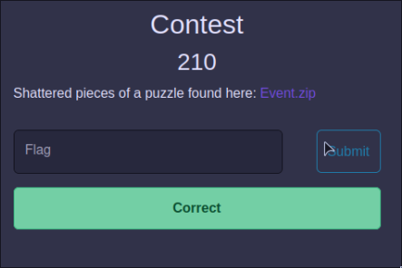

# challenge

Shattered pieces of a puzzle found here: [Event.zip](https://ctf.shaastractf2024.online/files/b3a7d7830e0293443383479058b9e8e4/Event.zip)

# solution

the challenge  contain 1 jpg file and separate binaries for windows and linux 

the `Event.jpg` file is corrupted 

with these information i am going to do these following things

- get exif data and static analysis of both image and binary
- Try to fix the corrupted image files 

## step 1

by checking the strings of `Event.jpg` is got the first part of the flag

which is 

> `ShaastraCTF{H4pPy`

## step 2

now we have the first part of the flag

so i am going to fix the data of the `jpg` file 

open the file in any hex editor in this case i am using `ghex` 

by opening the image is notices that the magic numbers of jpeg is not correct here 

> Magic numbers are the first bits of a file which uniquely identify the type of file. This makes programming easier because complicated file structures need not be searched in order to identify the file type.

according to [this](https://gist.github.com/leommoore/f9e57ba2aa4bf197ebc5#image-files)

the magic numbers of `jpg` is `ff d8 ff e0` (in hex)

so i changed the bits to 

and saved the image and tried opening it with any image viewer

the image is fixed and we got the second part of the flag

which is 

>`_n3W`

## step 3

we got the first and second part of the flag 

now are moving on to the analysis of binary in this case i am using ELF binary because i am using Linux 

I run `strings` command in the binary 

by looking in to the strings i found the third and final part of the flag

which is

> _Y34R!}

## step 4

now we have to join all these  parts to one

 > `ShaastraCTF{H4pPy_n3W_Y34R!}`

so this is our final flag

